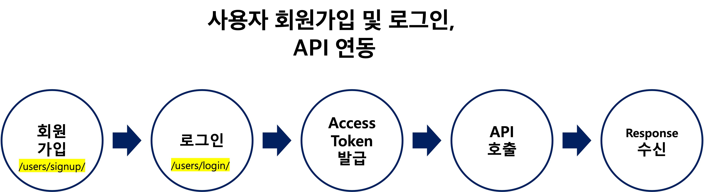
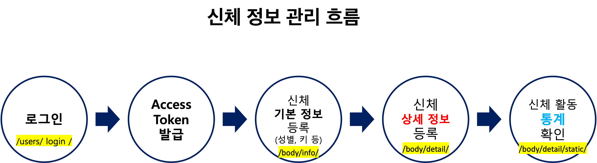
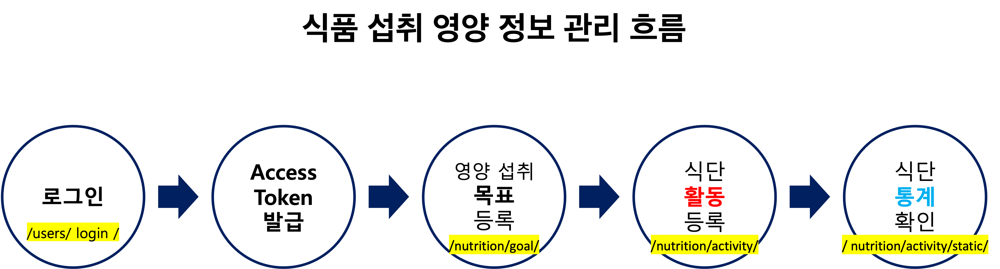
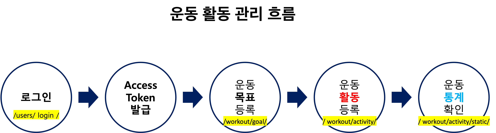

# 연동흐름도

## 사용자 회원가입 및 로그인, API 연동 흐름
- 가장 먼저, 회원가입을 하고 Email과 암호를 입력하여 로그인을 합니다. 로그인 시 발급된 Access Token으로 API 연동을 호출 합니다

## 신체 정보 관리 흐름
- 회원가입 시 입력한 성별, 생년월일 정보와 함께 키 등의 기본 정보를 등록하고 날짜별 몸무게, 체지방률, 골격근량을 입력합니다. 이 후 측정할 때마다 등록하여 통계를 통해 분석하여 향 후 목표를 설정합니다

## 식품 섭취 영양 정보 관리 흐름
- 영양 섭취에 대한 목표를 설정하고 식단 활동을 아침, 점심, 저녁 등 식단을 기록합니다. 이후 통계를 분석하고 목표에 도달할 수 있도록 추적 관찰합니다

## 운동 활동 정보 관리 흐름
운동 목표를 설정합니다. 예를 들어 하루 칼로리 200kcal 달성, 런닝 30분 달성 등 구체적으로 설정합니다. 이후 운동 활동을 등록하고 통계를 통해 목표 달성을 관찰합니다

