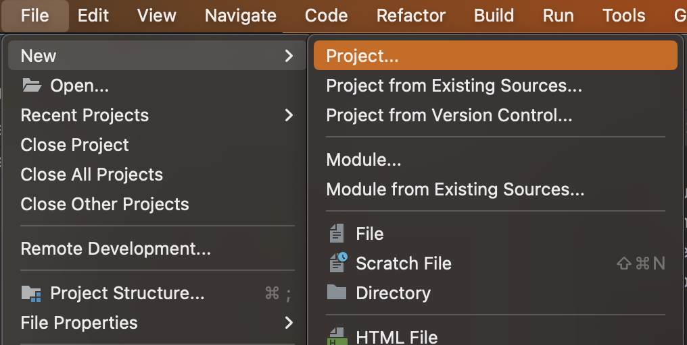
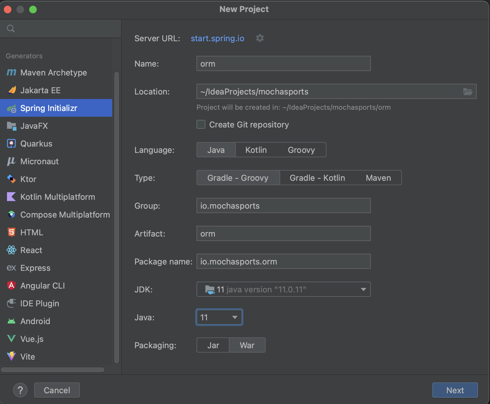
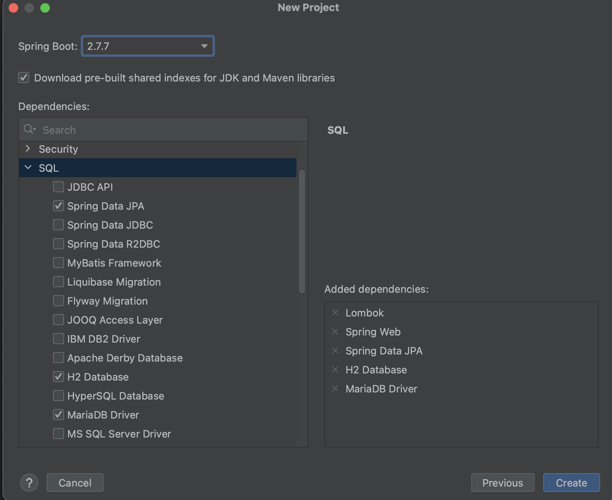
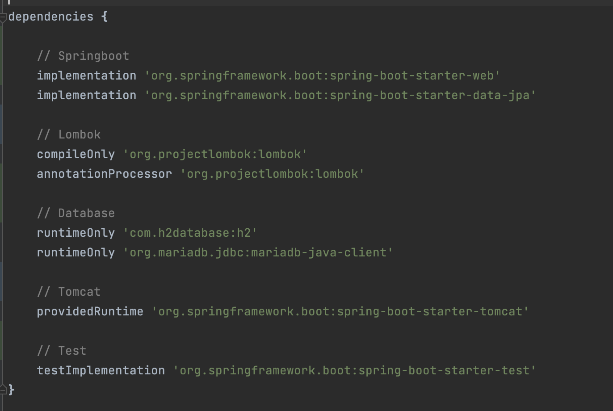

# 사전 준비

## 프로젝트 생성
1. IntelliJ 실행
2. 프로젝트 생성
- 상단 메뉴 File -> New -> Project 선택
  
3. Spring initializr로 프로젝트 생성
- Type: Gradle
- JDK:JDK 11
- Packaging: War  
  

4. 라이브러리 선택(Lombok, Spring Web, Spring DataJPA, H2 Database)
   

5. build.gradle dependencies 추가
- JPA 필수 라이브러리: spring-boot-starter-data-jpa
```groovy
  dependencies {
      implementation 'org.springframework.boot:spring-boot-starter-data-jpa'
  }
```

6. application.yml 파일 생성
- application.properties 파일 확장자 yml로 변경
  
