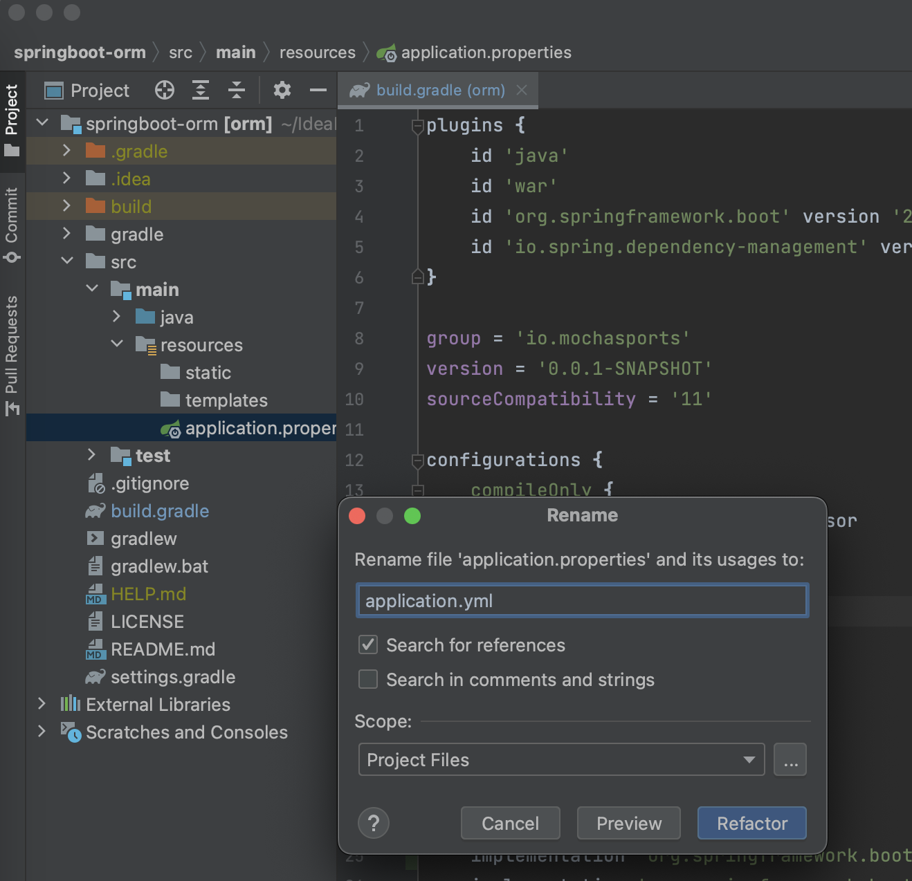

# 사전 준비

## 프로젝트 생성
1. IntelliJ 실행

1. 프로젝트 생성
- 상단 메뉴 File -> New -> Project 선택

1. Spring initializr로 프로젝트 생성
- Type: Gradle
- JDK:JDK 11
- Packaging: War  

- 라이브러리 선택(Lombok, Spring Web, Spring DataJPA, H2 Database)

- build.gradle dependencies 확인
  - JPA 필수 라이브러리: spring-boot-starter-data-jpa
  

- application.yml 파일 생성
  - application.properties 파일 확장자 yml로 변경
  
