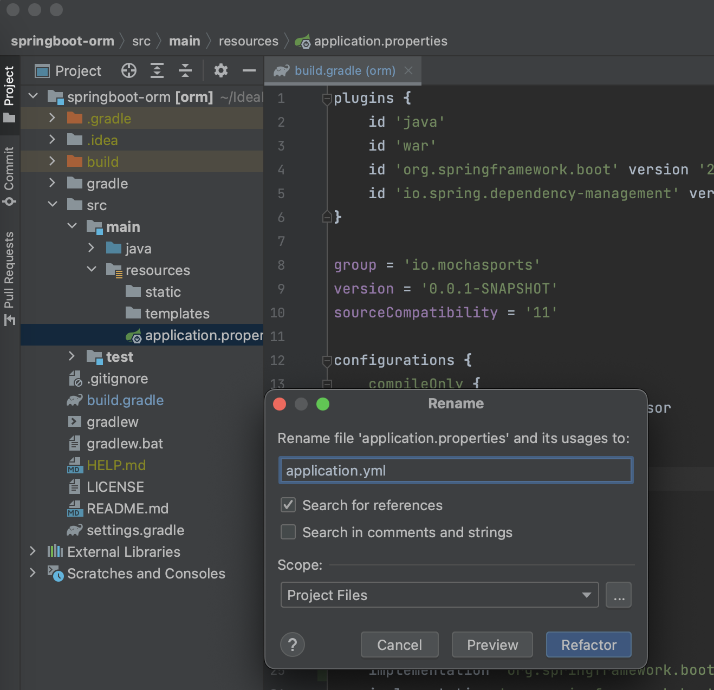

# JPA(Java Persistence API) 란?

JPA는 자바 진영에서 ORM(Object-Relational Mapping) 기술 표준으로 사용되는 
인터페이스의 모음이다.
JPA를 사용하면 객체 지향적인 코드를 작성하여 손쉽게 맵핑할 수 있다. 
다양한 프레임워크가 존재하지만 가장 대중적인 것은 하이버 네이트이다.

## JPA 장점
1. 생산성 향상
기존의 방식은 SQL을 직접 작성하여 CRUD의 반복적인 코드를 개발자가 작성해야하지만 
JPA를 사용하면 객체 지향적인 코드를 작성하여 손쉽게 맵핑할 수 있다.
데이터베이스 설계 중심을 객체 설계 중심으로 변경할 수 있다. 
개발자는 객체 모델을 이용하여 비즈니스 로직을 구성하는데 집중할 수 있음.

2. 유지보수
DB 컬럼을 추가/삭제하는 경우 SQL과 JDBC 코드를 수정해야하지만, 
JPA는 객체를 자동으로 맵핑하기 때문에 개발자가 유지보수 해야하는 코드가 줄어든다.
여러 가지 요구사항으로 기능 수정이 발생해도 DB부터 더 간편하게 수정이 가능하다.
매핑하는 정보가 Class로 명시 되었기 때문에 ERD를 보는 의존도를 낮출 수 있고 
유지보수 및 리팩토링에 유리하다

3. 데이터베이스 벤더 독립성
Oracle, MySQL 등 DB 벤더에 따라 조금씩 다른 SQL 문법 때문에 DB 벤더를 변경하는 경우 SQL문을 다시 작성해야하는 번거로움이 발생했다. 
JPA는 DB 벤더에 독립적으로 개발이 가능하다.

