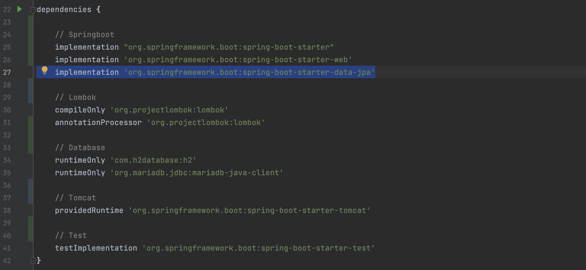
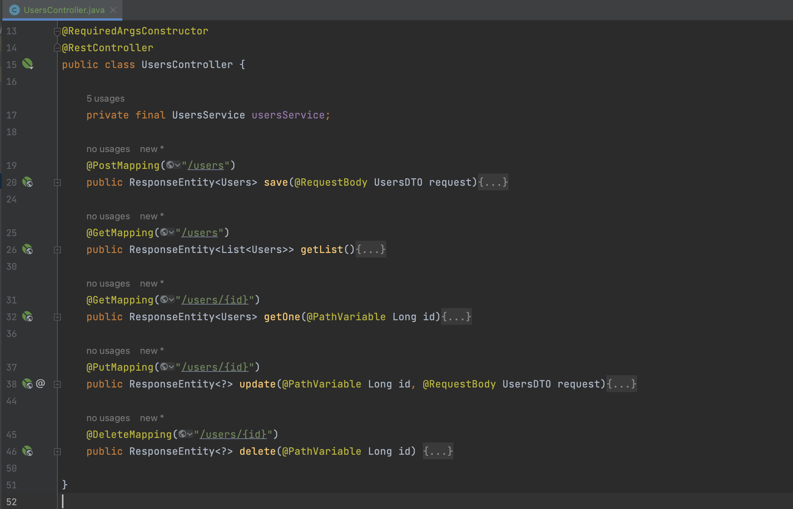
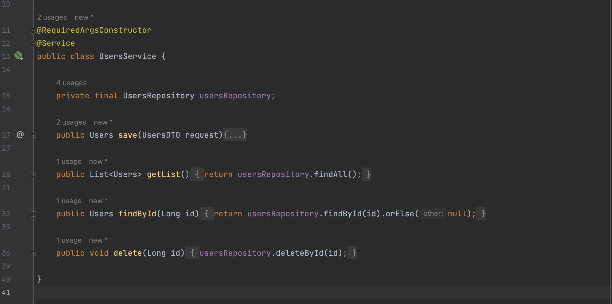
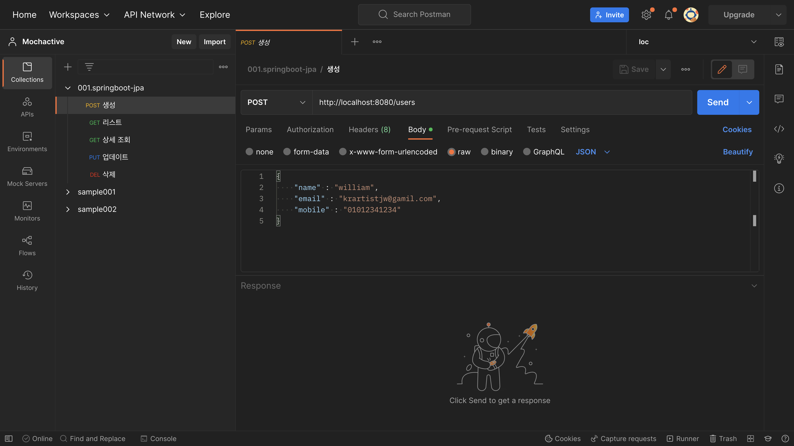
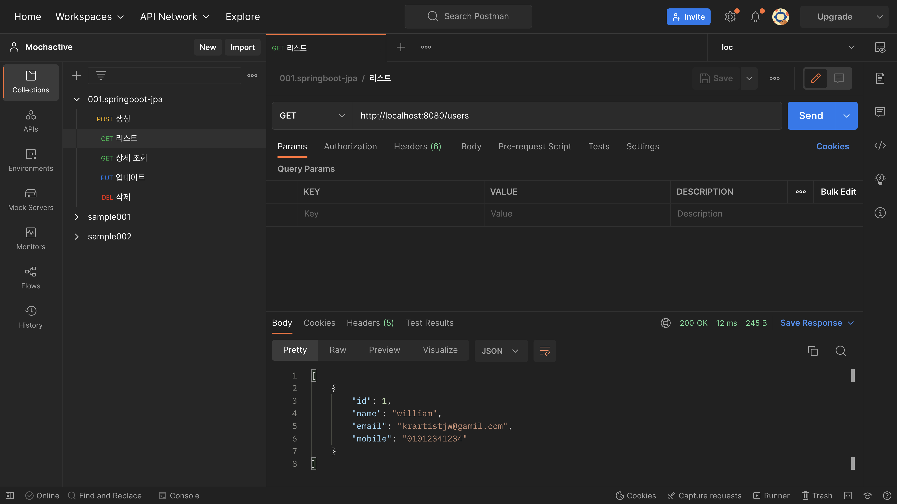
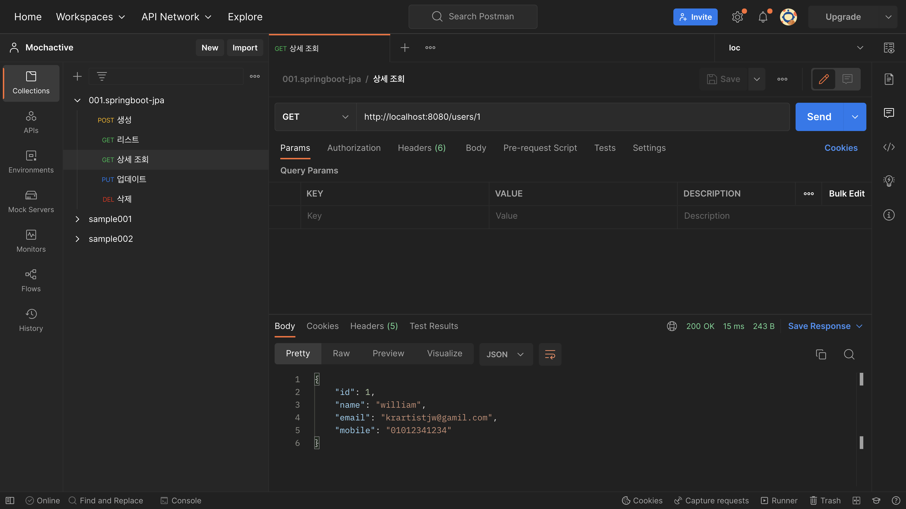
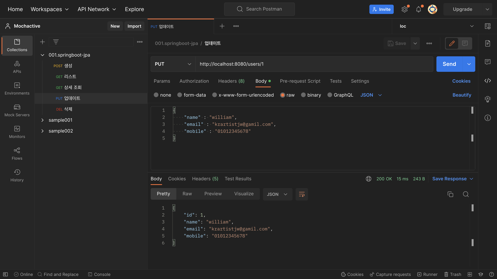
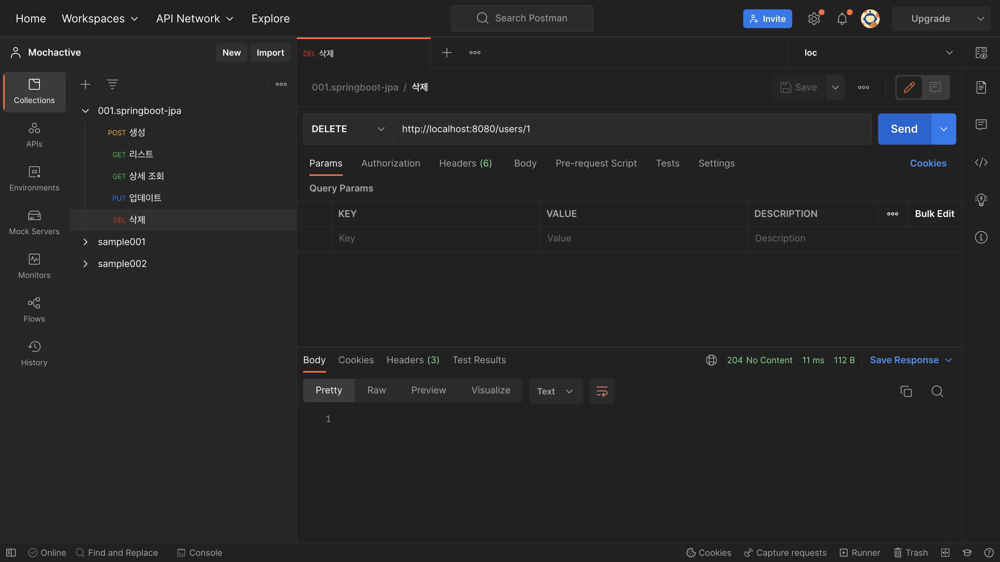

# JPA(Java Persistence API) 설치 및 초기 설정

## JPA 프로젝트 전체 구조
- domain: entity 선언부, Application에서 사용할 객체이자 Database에서 사용하는 컬럼명
- dto: 계층간 데이터 교환을 위해 사용하는 객체
- repository: JPA에서 선언한 인터페이스로 SQL문 대신 손쉽게 사용할 수 있는 쿼리 선언부
- controller: Rest API 선언부
- service: 비즈니스 로직 구현


## build.gradle 설정
- JPA 라이브러리 선언
```groovy
dependencies {
    implementation 'org.springframework.boot:spring-boot-starter-data-jpa'
}
```



## Application.yml 설정
- Datasource: h2
- JPA는 ddl-auto: create를 사용하여 어플리케이션 실행 시 자동으로 Domain에 선언된 객체를 참조하여 Database Table 및 컬럼을 생성한다

```yaml
spring:
  datasource:
    driver-class-name: org.h2.Driver
    url: jdbc:h2:mem:ormdb
    user: sa
    password:
  jpa:
    hibernate:
      ddl-auto: create
    properties:
      hibernate:
        dialect: org.hibernate.dialect.H2Dialect # H2 엔진 설정
        format_sql: true
        show-sql: true # sql문 로그 활성화
    defer-datasource-initialization: true

logging:
  level:
    org.hibernate.sql: debug
```

## Domain 생성
사용자 테이블을 생성. 컬럼은 id, name, email, mobile로 정의

```java
@Builder
@Entity
@Getter
@Setter
@NoArgsConstructor(access = AccessLevel.PROTECTED)
@AllArgsConstructor
public class Users {

    @Id
    @GeneratedValue(strategy = GenerationType.AUTO)
    private Long id;

    private String name;

    private String email;

    private String mobile;

}
```


## DTO 생성
RestfulAPI로 client와 통신할 때 사용할 객체 선언

```java
@Getter
@Setter
public class UsersDTO {

    private Long id;

    private String name;

    private String email;

    private String mobile;

}
```

## Repository 생성
JpaRepository를 상속받고 Users를 참조, Users Entity의 ID의 데이터 타입인 Long을 선언한다
```java
public interface UsersRepository extends JpaRepository<Users, Long> {

}
```

## Controller 생성
### 전체 Controller 구조
사용자를 생성, 목록 조회, 상세 조회, 수정, 삭제 기능을 구현


### 컨트롤러 설정
- `@RestController`를 선언하여 rest api를 제공하는 controller임을 명시.
- 생성자 주입방식으로 UsersService를 참조
 
```java
@RequiredArgsConstructor
@RestController
public class UsersController {

    private final UsersService usersService;

}
```

### 저장
- `@PostMapping("/users")`를 선언하여 Post 방식으로 http://{domain}/users를 호출할 것을 명시
- usersService의 save 메소드를 호출

```java
@RequiredArgsConstructor
@RestController
public class UsersController {

    private final UsersService usersService;
    
    @PostMapping("/users")
    public ResponseEntity<Users> save(@RequestBody UsersDTO request){
        Users users = usersService.save(request);
        return ResponseEntity.status(HttpStatus.CREATED).body(users);
    }
}
```

### 목록 조회
- `@GetMapping("/users")`를 선언하여 Get 방식으로 http://{domain}/users를 호출할 것을 명시
- usersService의 getList 메소드를 호출

```java
@RequiredArgsConstructor
@RestController
public class UsersController {

    private final UsersService usersService;
    
    @GetMapping("/users")
    public ResponseEntity<List<Users>> getList(){
        List<Users> users = usersService.getList();
        return ResponseEntity.ok().body(users);
    }
    
}
```


### 상세 조회
- `@GetMapping("/users/{id}")`를 선언하여 Get 방식으로 http://{domain}/users/{사용자ID}를 호출할 것을 명시
- usersService의 findById 메소드를 호출

```java
@RequiredArgsConstructor
@RestController
public class UsersController {

    private final UsersService usersService;

    @GetMapping("/users/{id}")
    public ResponseEntity<Users> getOne(@PathVariable Long id){
        Users users = usersService.findById(id);
        return ResponseEntity.ok().body(users);
    }
    
}
```


### 수정
- `@PutMapping("/users")`를 선언하여 Put 방식으로 http://{domain}/users/{사용자ID}를 호출할 것을 명시
- usersService의 save 메소드를 호출

```java
@RequiredArgsConstructor
@RestController
public class UsersController {

    private final UsersService usersService;

    @PutMapping("/users/{id}")
    public ResponseEntity<?> update(@PathVariable Long id, @RequestBody UsersDTO request){
        request.setId(id);

        Users users = usersService.save(request);
        return ResponseEntity.ok().body(users);
    }
    
}
```


### 삭제
- `@DeleteMapping("/users/{id}")`를 선언하여 Delete 방식으로 http://{domain}/users/{사용자ID}를 호출할 것을 명시
- usersService의 delete 메소드를 호출

```java
@RequiredArgsConstructor
@RestController
public class UsersController {

    private final UsersService usersService;

    @DeleteMapping("/users/{id}")
    public ResponseEntity<?> delete(@PathVariable Long id) {
        usersService.delete(id);
        return ResponseEntity.noContent().build();
    }
    
}
```


## Service 설정
### 전체 Service 구조


### 서비스 설정
- `@Service`를 선언하여 rest api에서 비즈니스 로직을 처리하는 클래스임을 명시.
- 생성자 주입방식으로 UsersRepository를 참조

```java
@RequiredArgsConstructor
@Service
public class UsersService {

    private final UsersRepository usersRepository;

}
```


### 생성 및 수정
빌더 패턴을 사용하여 DTO에 담은 객체를 Users Entity에 맵핑하고 `save` 메소드로 Database에 추가 및 수정한다.

이때, save 메소드는 DTO에 담겨있는 ID를 참조하여 Database에 ID가 없는 경우 insert를 하고 ID가 존재하는 경우에는 update 쿼리를 실행한다.

```java
@RequiredArgsConstructor
@Service
public class UsersService {

    private final UsersRepository usersRepository;

    public Users save(UsersDTO request){
        Users users = Users.builder()
                .id(request.getId())
                .name(request.getName())
                .email(request.getEmail())
                .mobile(request.getMobile())
                .build();

        return usersRepository.save(users);
    }

}
```

### 목록 조회
- `findAll`을 실행하여 Users 리스트를 조회한다.
- `select * from users`와 동일한 결과를 출력한다.

```java
@RequiredArgsConstructor
@Service
public class UsersService {

    private final UsersRepository usersRepository;

    public List<Users> getList(){
        return usersRepository.findAll();
    }

}
```

### 상세 조회
- `findById`을 실행하여 DTO에서 넘겨받은 ID를 조회한다.
- `select * from users where id = {{id}}`와 동일한 결과를 출력한다

```java
@RequiredArgsConstructor
@Service
public class UsersService {

    private final UsersRepository usersRepository;

    public Users findById(Long id) {
        return usersRepository.findById(id).orElse(null);
    }

    public void delete(Long id) {
        usersRepository.deleteById(id);
    }

}
```

### 삭제
- `deleteById`을 실행하여 DTO에서 넘겨받은 ID를 삭제한다.

```java
@RequiredArgsConstructor
@Service
public class UsersService {

    private final UsersRepository usersRepository;

    public void delete(Long id) {
        usersRepository.deleteById(id);
    }

}
```


## Postman API 테스트

### 생성


### 목록 조회


### 상세 조회


### 수정


### 삭제


## Github 링크
- Git Repo URL: [springboot-orm](https://github.com/krartistjw/springboot-orm.git)
- 브랜치: `002-init-jpa` 
