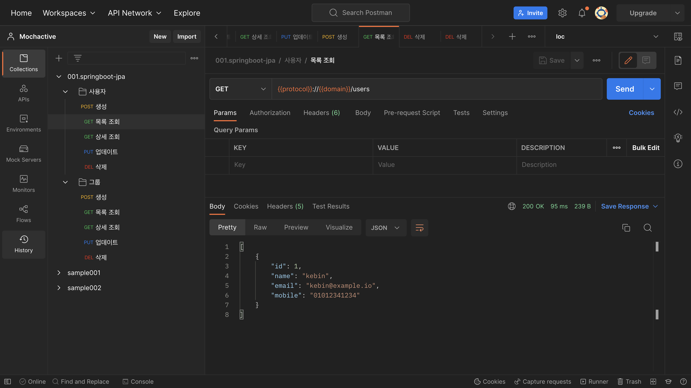

# JPA 1:N, N:1 양방향 관계 맵핑
- JPA를 활용하여 1:N, N:1 양방향 관계 설정에 대한 정의

## JPA 프로젝트 전체 구조
- domain: entity 선언부, Application에서 사용할 객체이자 Database에서 사용하는 컬럼명
- dto: 계층간 데이터 교환을 위해 사용하는 객체
- repository: JPA에서 선언한 인터페이스로 SQL문 대신 손쉽게 사용할 수 있는 쿼리 선언부
- controller: Rest API 선언부
- service: 비즈니스 로직 구현


## DB 테이블 정의
- 그룹은 여러 명의 사용자를 소유할 수 있음
- 사용자는 하나의 그룹에 속할 수 있음
- 그룹과 사용자 테이블의 관계는 1:N 으로 정의


## Domain 정의
### 그룹, @OneToMany 설정
- 그룹 테이블을 생성. 컬럼은 id, name으로 정의
- `@OneToMany` 어노테이션을 선언하여 1대N 관계 정의
- `@JsonManagedReference`을 선언하여 루프 발생 제어
- `fetch = FetchType.LAZY` 옵션은 지연 로딩을 발생시켜 실제로 users를 사용하는 비즈니스 로직에서 users 테이블 조회
- `cascade = { CascadeType.PERSIST }` Child도 함께 데이터 변경 사항을 반영하고, Child 데이터가 삭제되지 않고 유지되도록 설정

```java
@Builder
@Entity
@Getter
@Setter
@NoArgsConstructor(access = AccessLevel.PROTECTED)
@AllArgsConstructor
public class Groups {

    @Id
    @GeneratedValue(strategy = GenerationType.AUTO)
    private Long id;

    private String name;

    @JsonManagedReference
    @OneToMany(
        mappedBy = "groups",
        fetch = FetchType.LAZY,
        cascade = { CascadeType.PERSIST }
    )
    private List<Users> users = new ArrayList<>();

}
```


### 사용자, @ManyToOne 설정
- `@ManyToOne` 어노테이션을 선언하여 N대1 관계 정의
- `@JsonBackReference`을 선언하여 루프 발생 제어
- `@JoinColumn(name = "group_id")`으로 대상 테이블의 ID와 맵핑

```java
@Builder
@Entity
@Getter
@Setter
@NoArgsConstructor(access = AccessLevel.PROTECTED)
@AllArgsConstructor
public class Users {

    @Id
    @GeneratedValue(strategy = GenerationType.AUTO)
    private Long id;

    private String name;

    private String email;

    private String mobile;

    @JsonBackReference
    @ManyToOne
    @JoinColumn(name = "group_id")
    private Groups groups;

}
```


## DTO 생성
### 그룹, DTO 생성
- id와 name을 인자로 선언
- `List<Users> users = new ArrayList<>()` 객체 선언하여 users 객체를 Layer간 통신 시 이용할 수 있도록 정의

```java
@Getter
@Setter
public class GroupsDTO {

    private Long id;

    private String name;

    private List<Users> users = new ArrayList<>();

}
```


### 사용자, DTO 수정
- Group을 추가

```java
@Getter
@Setter
public class UsersDTO {

    private Long id;

    private String name;

    private String email;

    private String mobile;

    private Groups groups;

}
```


## Repository 생성
- Group Repository 파일을 생성, 비즈니스 로직에서 JPA를 사용할 수 있도록 설정

```java
    public interface GroupsRepository extends JpaRepository<Groups, Long> {
    }

```


## Controller 생성

### 그룹 컨트롤러 생성
- 그룹 생성: POST http://{domain}/groups
- 그룹 목록 조회: GET http://{domain}/groups
- 그룹 상세 조회: GET http://{domain}/groups/{그룹ID}
- 그룹 수정: PUT http://{domain}/groups/{그룹ID}
- 그룹 삭제: DELETE http://{domain}/groups/{그룹ID}

```java
@RequiredArgsConstructor
@RestController
public class GroupsController {

    private final GroupsService groupsService;

    @PostMapping("/groups")
    public ResponseEntity<Groups> save(@RequestBody GroupsDTO request){
        Groups groups = groupsService.save(request);
        return ResponseEntity.status(HttpStatus.CREATED).body(groups);
    }

    @GetMapping("/groups")
    public ResponseEntity<List<Groups>> getList(){
        List<Groups> groups = groupsService.getList();
        return ResponseEntity.ok().body(groups);
    }

    @GetMapping("/groups/{id}")
    public ResponseEntity<Groups> getOne(@PathVariable Long id){
        Groups groups = groupsService.findById(id);
        return ResponseEntity.ok().body(groups);
    }

    @PutMapping("/groups/{id}")
    public ResponseEntity<?> update(@PathVariable Long id, @RequestBody GroupsDTO request){
        request.setId(id);

        Groups groups = groupsService.save(request);
        return ResponseEntity.ok().body(groups);
    }

    @DeleteMapping("/groups/{id}")
    public ResponseEntity<?> delete(@PathVariable Long id) {
        groupsService.delete(id);
        return ResponseEntity.noContent().build();
    }

}
```


## Service 설정
### 그룹 서비스 설정
- save: 생성 및 수정
- getList: 목록 조회
- findById: 상세 조회
- delete: 삭제

```java
@RequiredArgsConstructor
@Service
public class GroupsService {

    private final GroupsRepository groupsRepository;

    public Groups save(GroupsDTO request){
        Groups groups = Groups.builder()
                .id(request.getId())
                .name(request.getName())
                .build();

        return groupsRepository.save(groups);
    }

    public List<Groups> getList(){
        return groupsRepository.findAll();
    }

    public Groups findById(Long id) {
        return groupsRepository.findById(id).orElse(null);
    }

    public void delete(Long id) {
        groupsRepository.deleteById(id);
    }

}
```


### 사용자 서비스 수정
- `.groups(request.getGroups())`를 추가하여 사용자 데이터를 생성 및 수정할 때 그룹 정보도 포함 하도록 설정

```java
@RequiredArgsConstructor
@Service
public class UsersService {

    private final UsersRepository usersRepository;
    private final GroupsRepository groupsRepository;

    public Users save(UsersDTO request){

        Users users = Users.builder()
                .id(request.getId())
                .name(request.getName())
                .email(request.getEmail())
                .mobile(request.getMobile())
                .groups(request.getGroups())
                .build();

        return usersRepository.save(users);
    }

}
```

## Postman API 테스트

### 그룹 생성
- USERS: CRUD, GROUPS: ~~C~~RUD
- `developer`, `ux designer` 그룹 생성


### 사용자 생성(그룹 정보 포함)
- USERS: ~~C~~RUD, GROUPS: ~~C~~RUD
- `kebin` 사용자 생성


### 사용자 생성(그룹 정보 미포함)
- `alex` 사용자 생성


### 사용자 목록 조회
- USERS: ~~C~~~~R~~UD, GROUPS: ~~C~~RUD


### 그룹 목록 조회
- USERS: ~~C~~~~R~~UD, GROUPS: ~~C~~~~R~~UD
- `kebin`은 `developer` 그룹 정보에 확인
- `alex`는 그룹 목록에서 확인 불가


### 사용자 수정
- USERS: ~~C~~~~R~~~~U~~D, GROUPS: ~~C~~~~R~~UD
- `alex`에게 `ux designer` 그룹 정보 추가


### 그룹 상세 조회
- `ux designer` 그룹 상세 조회에서 `alex` 확인


### 그룹 수정
- USERS: ~~C~~~~R~~~~U~~D, GROUPS: ~~C~~~~R~~~~U~~D
- `developer`그룹명 `backend developer`로 그룹명 변경


### 그룹 상세 조회
- `backend developer`로 그룹명 변경된 것을 확인


### 사용자 삭제
- USERS: ~~C~~~~R~~~~U~~~~D~~, GROUPS: ~~C~~~~R~~~~U~~D
- `alex` 사용자 삭제


### 사용자 목록 조회
- 사용자 목록 조회에서 `alex`가 삭제된 것 확인




### 그룹 상세 조회
- `ux designer` 그룹 상세 조회에서 `alex`가 삭제된 것 확인


### 그룹 삭제
- USERS: ~~C~~~~R~~~~U~~~~D~~, GROUPS: ~~C~~~~R~~~~U~~~~D~~
- `backend developer` 그룹 삭제


### 그룹 목록 조회
- 그룹 목록 조회에서 `backend developer`가 삭제된 것 확인


### 사용자 목록 조회
- `backend developer` 그룹 삭제로 사용자 `kebin`이 삭제되지 않았는지 확인


## Github 링크
- Git Repo URL: [springboot-orm](https://github.com/krartistjw/springboot-orm.git)
- 브랜치: `003-jpa-onetomany` 
