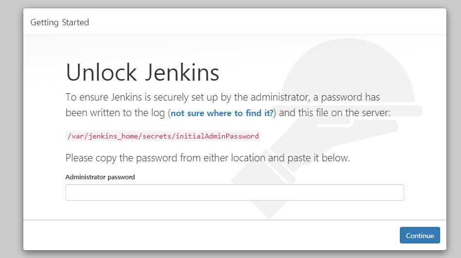

# Jenkins 설치(Install)

## 공식홈페이지 접속

- [Jenkins](https://www.jenkins.io)
- [Jenkins Download](https://www.jenkins.io/download/)


## 사전 준비사항

1. OS: Rhel 8.X

2. JAVA: JDK 11

3. Node.js: Node.js LST(18.12.1)

4. 어플리케이션 Root 디렉토리 생성
- 참고: `/app` 디렉토리는 OS가 실행되는 root영역과 독립적으로 입출력을 할 수 있는 별도의 디스크를 디렉토리로 마운트

5. 서비스 디렉토리 생성
- jenkins: /app/jenkins
- docker: /app/docker


## Jenkins 설치

### Option 1. Yum 설치

1. 명령어 입력

`yum install jenkins`


### Option 2. Docker 설치

1. 명령어 입력
- JDK1.8: `docker run jenkins/jenkins`
- JDK11: `docker run jenkins/jenkins:lts-jdk11`


### Option 3. Docker Compose 설치

1. Jenkins 디렉토리 생성
- `cd /app && mkdir jenkins`


2. docker-compose 폴더 생성
```
# /app 디렉토리로 이동
> cd /app 

# docker-compose 폴더 생성
> mkdir docker-compose
```


3. yml 파일 생성
- `vi docker-compose-jenkins.yml`


4. yml 작성
```
# 추후 작성
```


5. docker-compose로 Jenkins 설치
docker-compose -f /app/docker-compose-jenkins.yml


## Jenkins 초기 설정

1. 브라우저 접속

2. 서버에서 초기 관리자 암호 확인 후 입력
`cat /app/jenkins/secrets/initialAdminPassword`



3. 관리자 계정 생성


4. 로그인


5. 초기 설치 완료