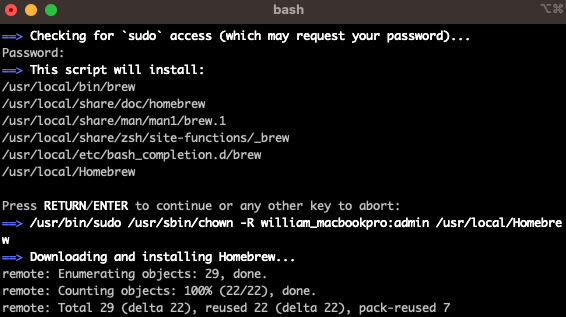

# Homebrew 설치

## Homebrew 란?

- 터미널 CLI(Command-line interface) 환경에서 명령어를 작성하여 손쉽게 프로그램을 설치, 업데이트, 삭제 등을 할 수 있도록 도와주는 도구이다.

## 사전정보

- Homebrew 공식 페이지: https://brew.sh/index_ko

## 설치

1. 터미널 실행 

   

2. Install 명령어 실행
   
   `/bin/bash -c "$(curl -fsSL https://raw.githubusercontent.com/Homebrew/install/HEAD/install.sh)"`
   
   

3. Mac 로그인에 사용되는 비밀번호 입력

   

4. Homebrew 설치 완료

   
