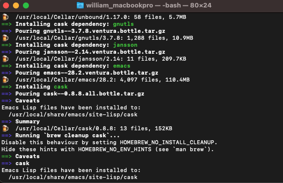
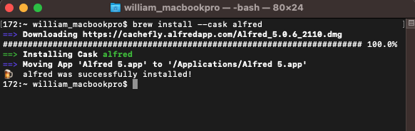
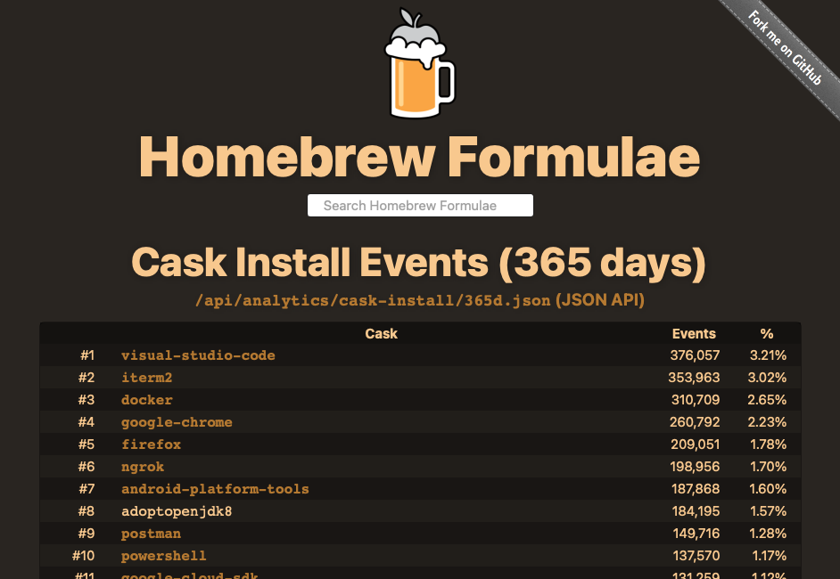

# Homebrew Cask 설치

## Homebrew Cask 란?

- Cask는 Chrome, MS Offile, VS Code 등과 같은 GUI 기반의 어플리케이션을 설치할 수 있는 패키지다.

## Homebrew Cask 설치

1. 터미널에서 명령어 입력

   `brew install cask`

   

2. 설치 완료

   

## Homebrew Cask를 이용한 프로그램 설치

1. brew 패키지 최신 버전으로 업데이트

   `brew update`

2. 프로그램 설치

   `brew install --cask [프로그램명]`

   예시: `brew install --cask alfred`

   

## Homebrew Cask 통계 페이지

1. Homebrew cask로 설치한 프로그램 통계

   [Homebrew Formulae](https://formulae.brew.sh/analytics/cask-install/365d)

   

