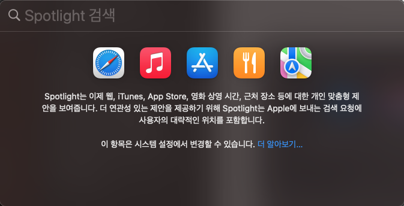
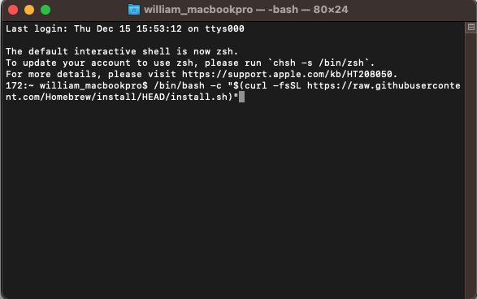
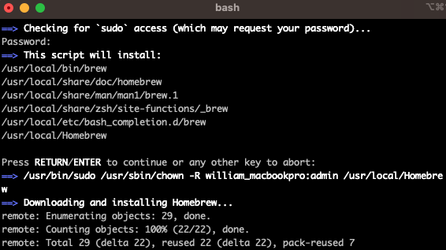
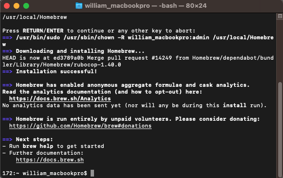

# Homebrew

## Homebrew 란?
터미널 CLI(Command-line interface) 환경에서 명령어를 작성하여 손쉽게 프로그램을 설치, 업데이트, 삭제 등을 할 수 있도록 도와주는 도구이다.

## 사전정보
- Homebrew 공식 페이지: https://brew.sh/index_ko

## 설치
1. 터미널 실행

1. Install 명령어 실행
`/bin/bash -c "$(curl -fsSL https://raw.githubusercontent.com/Homebrew/install/HEAD/install.sh)"`

1. Mac 로그인에 사용되는 비밀번호 입력

1. Homebrew 설치 완료

